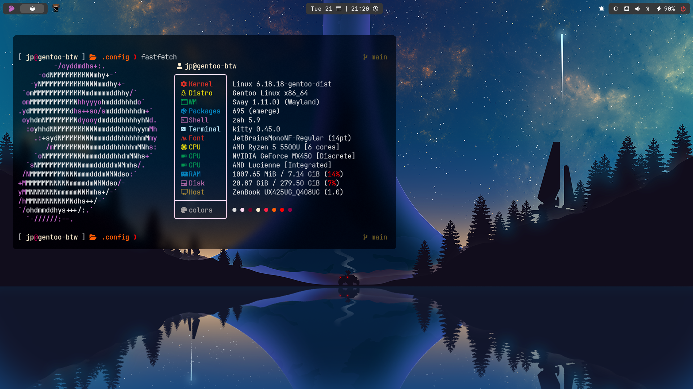

# Dotfiles
My personal Linux configuration files

## Stack
- WM: Swayfx
- Lock: Hyprlock
- Notifications: Swaync
- Terminal: Kitty
- Launcher: Rofi**
- Shell: Zsh + Starship
- Editor: Neovim (LazyVim)
- Bar: Waybar
- Fetch: Fastfetch

## Preview

